# Valyr
Valyr is a 2+ Player Game revolving around making an army of units and having them battle it out anywhere (on your tabletop). The game revolves around a “True Movement” system that uses actual distance measuring to move units in your game to defeat your opponents.

# Getting Started

## What you will need

To play a standard game of Valyr you will need a ruler or tape measure, a standard dice set, and any table - Don't even worry about clearing it off!

## Building an Army

At the beginning of the game each player will create or come with an "army" consisting of units with a total "appraisal" value less than or equal to an agreed upon amount (Generally 1000). The "appraisal" value of a card is shown in the bottom right corner.

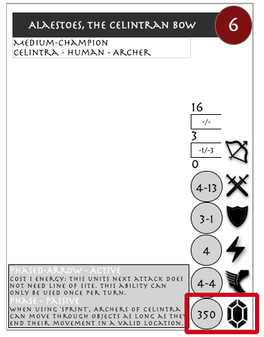

## Starting the Game

The player with the lowest appraisal value takes the priority token. In the event of a tie, the youngest player starts with the priority token.

## Setup

Starting with the player with the priority token, each player will take their unit cards and place them adjacent to each other on an edge of the battlefield. Then each subsequent player to the left will place their unit cards onto the battlefield. These cards denote a teams "starting location". Then in the same order, each player will place their units within 3 range of their starting location.

### Starting The Game

The first "round" of the game begins with the player with the priority token. This player will take a "turn" by choosing a unit and turning that unit card sideways denoting the unit as "exhausted". After each "turn", the player to the left takes a "turn". If all units are "exhausted" at the beginning of a turn, that turn is skipped.

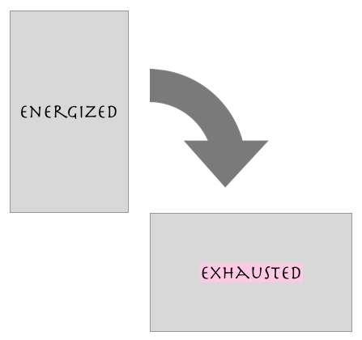

### Taking A Turn

When a turn begins, a player may take a number of actions less than or equal to the amount of energy the unit they chose that turn has:

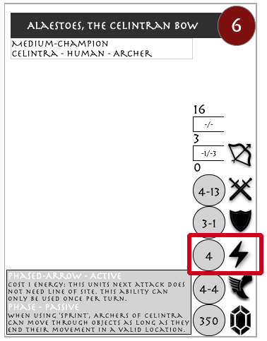

There are three types of actions a unit can take

1. ["Move"](#move-action)
2. ["Attack"](#attack-action)
3. ["Use an Ability"](#ability-action)

After a player has completed their units actions for a turn, the turn is passed and the player to their left takes a turn.

### Actions

#### Move Action
If the move action is chosen, the player will look at their unit's movement stat (marked by the winged boots icon) pick up their unit and place it back down within it's movement range.


The movement stat has two numbers -- a sprint value and a sustain value (marked as spint-sustain). The first time a unit moves on a turn, it can move a distance up to its sprint value. Each subsequent movement a unit makes that turn can move up to its sustain value. Each movement consumes one energy.

Movement actions must end on a location where the unit can stand of it's own, without support. If a precariously placed unit's model falls due to an edge or incline, it is concerned "fallen". A fallen unit is left where it lands, must use it's next action to "stand up," it's block and dodge values are both set to zero, and it's passive abilities do not take effect.

#### Attack Action
You may also choose to attack another unit. In order to perform an attack action, choose a unit who is a distance from your unit between your minimum range and maximum range.

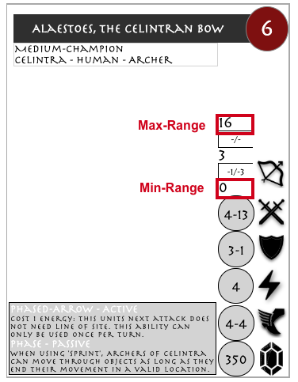

After choosing a unit, look at your units attack skills (Denoted by the crossed sword icon). The first number is the strength value of your unit, the second number is the skill value of you unit (Denoted as strength-skill).

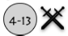

Next you will look a the range modifier value for the attack you are performing. As an example, if Alaestoes's base is 1 range away from the target's; Alaestos will have a range modifier of -1/-3 because the range is between 0 and 3. If Alaestoes's base is 6 range away from the target's Alaestor will have no range modifier because the range is between 3 and 16.

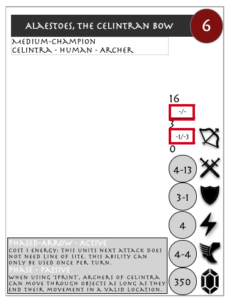

You will then modify your units strength and skill value by the numbers found in your range modifier. At range 1, Alaestoes would have a calculated strength value of 3 and skill value of 10 for the attack. At range 6, Alaestoes would have a calculated strength value of 4 and skill value of 13.

The attacking unit will roll a number of d20s equivalent to their caluclated strength value.

Then the attacker will look at the target unit's defense values (Denoted by the shield icon). The first number denotes a units block value and the second number denotes a units dodge value (Denoted as block-dodge).

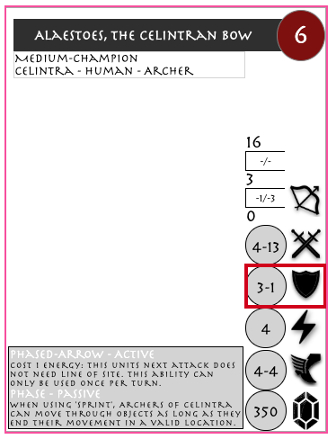

For each d20 rolled, if the value rolled is less than or equal to the attackers calculated skill value minus the defenders block value it counts as an "on target attack".

After calculating the number of "on target attacks", the defender can negate a number of them less than or equal to their dodge value.

The number of non-negated attacks are then assigned as "damage" to the defending unit.

If a unit has more damage than health at the end of an attack, it is considered defeated.

Combat Example:

If Alaestos is attacking a target at range 1.

Alaestos will calculate a strength value of 4 (4-0) and skill value of 13 (13-0) based on his range modifiers. NOTE: if Alaestos was attacking at range 1 he would have strength 3 (4-1) and skill 10 (13-3).


The target has block 3 and dodge 1.

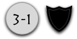

Alaestos rolls 4 dice (4 calculated strength), rolling a 7,10, 12, and 15.

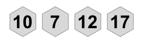

Alaestos scores 2 "on target attacks" from the 7 and 10 (13 skill - 3 block >= dice value)

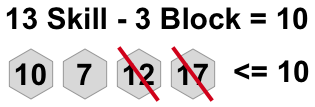

The defender will then negate up to their dodge value on target attacks.

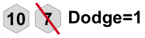

The defender takes 1 damage and the attack ends.

#### Ability Action

A unit can have two types of abilites passive and active.

A passive ability is not an action. it is an effect that modifies the state of the board.

As an an action, a unit can use an active ability described on their card, doing what is described in the ability's text.

```
  Active abilities go away if the unit is removed play.
  Abilites can override base rules.
  When text of an active ability conflicts with another ability in play, the more recently activated ability gets precedence.
```

### Defeating a Unit
If a unit ever has more damage then health, that unit is instantly considered defeated. All active abilities and effects from the the unit are negated, the unit's model is removed from the board, it's considered exhausted for the remainder of the game, and it is not able to take turns.

### Ending a Round
The round ends when all units for every player are "exhausted". The priority token is then passed to the right, all units are "energized" (no longer exhausted) and a new round begins.

### End of Game
If at any time all players except one have had all their units defeated or concede, the game ends and the last player standing wins.


# Unit Basics
In this game you will construct armies consisting of Units. Units will consists of stats which are contained in the Unit folder:

### Units predominant types and information will be contained under the units "Identity" explained below.

```
Identity: {
  Name: The units name.
  Basic_Description: Basic Description of what the unit looks like.
  Description: Full description of what the unit is in lore.
  Dynasty: The faction the unit belongs to.
  Type: The type of the unit. (Champion or Conscript) Champions can only be one ofs in an army, conscripts can be as many as you want.
  Class: The class of the unit
  Species: The units species.
  Distinctions: Distinct Traits the unit has.
  Size: Size of the unit.
}
```

### Units combat stats will be contained under the units "combat"

```
Combat: {
  Attack: (Strength-Skill) The number of d20 dice you get to roll when attacking (strength) and the number you have to roll below for a successfull attack (skill).
  Defense: (Armor-Dodge) The amount you can increase each d20 dice on an attack and the number of dice you can nullify completely.
  Range: (min-range-[strength modifier/skill modifier]-range[strength modifier/skill modifier]-max-range) The Range this unit can attack at and the change in their strength/skill at each range
  Energy: The amount of actions this unit can take on a turn.
  Movement: (Sprint-Stamina) How far this unit can move on it's first move of the turn (Sprint) and each subsequent move in the same turn (Stamina)
  Health: How much "damage" a unit can take before being defeated.
  Appraisal: How expensive this unit is to add to your army.
}
```

### Units also contain "Abilites" which consist of special actions and passives the unit has.

```
Abilites: {
  Name: {
    Type: Passive or Active (Active abilites take an action to use)
    Ability: A description of the ability.
    Template: A link to the template the ability uses (if needed)
  }
}
```

### Some Units also need extra components listed under components

```
Components: Extra components needed for this unit.
```

# Game Play Tenants
The core of this game is to allow creative flexibility and allow for quick wargame elements in any location. Much like collectible card games, design decisions should revolve around:
  1. Creativity. Restrictions breed creativity, but the meta should not revolve around specific elements. Location changes should make most units playable situationally.
  2. Game Speed. Gameplay should not be overly restricted or drag on. Scenarios should encourage quicker gameplay that does not drag out, especially in multiplayer scenarios.
  3. Tension Points. The game should lead to points where a good maneuver or role can swing the tide of the game. Clever Play - Luring opponents into a trap or executing a plan should be rewarded.
  4. Reward Flashy Plays. The game should encourage people to take actions, whatever they may be. Passive or auto play units and teams should be discouraged. General flexible plans should be neccessary.


#### Credits

"https://game-icons.net/1x1/lorc/wingfoot.html" by lorc is licensed under CC BY 3.0"<br/>
"https://game-icons.net/1x1/delapouite/rupee.html" by Delapouite is licensed under CC BY 3.0"
